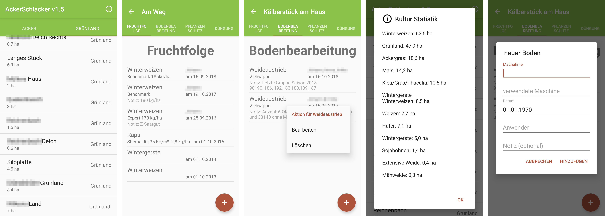

## AckerSchlacker

AckerSchlacker is a mobile App for agricultural enterprises to document operations on fields. It is used by farmers to take advantage of their mobile phone after finishing the work.
The entered information are synchronized immediately among all users, so that any staff member can track the on field operations.

### Tech-Stack:
- Java, Frontend with native Android Programming 
- Java Spring Boot, Backend with RestAPI + JSON
- Java Spring Data, JPA with MariaDB as persistent Database
- LaTeX PDF creation serverside

I built the App in 2016 for my family, to ease the listed documentation and statistics in a PDF file. 
In Germany, once a year every farmer is obliged to expose their pesticides in a so called 'Ackerschlagkartei'. 
If you speak out loud Ackerschlagkartei very quickly in German, it sounds like AckerSchlacker

### Screenshots

