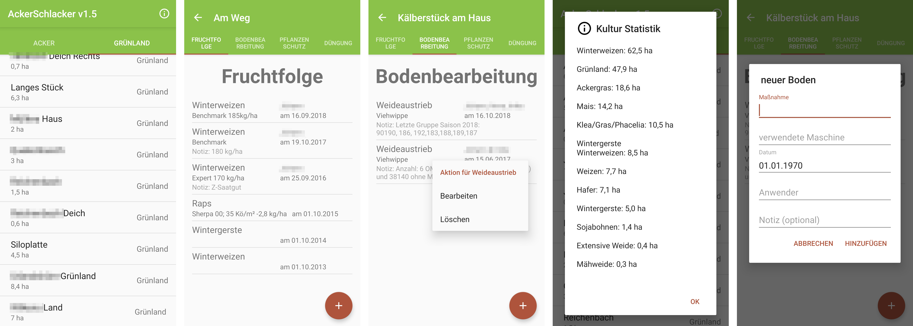

## AckerSchlacker

AckerSchlacker ist eine mobile App für Landwirtschaftsbetriebe zur Dokumentation von Feldarbeiten. Sie wird von Landwirten genutzt, um ihr Mobiltelefon nach der Arbeit sinnvoll einzusetzen.
Die eingegebenen Informationen werden sofort unter allen Nutzern synchronisiert, sodass jedes Teammitglied die Feldarbeiten verfolgen kann.

### Tech-Stack:
- Java, Frontend mit nativer Android-Programmierung
- Java Spring Boot, Backend mit RestAPI + JSON
- Java Spring Data, JPA mit MariaDB als persistente Datenbank
- LaTeX PDF-Erstellung serverseitig

Ich habe die App 2016 für meine Familie entwickelt, um die aufgelistete Dokumentation und Statistiken in einer PDF-Datei zu vereinfachen.
In Deutschland ist jeder Landwirt einmal im Jahr verpflichtet, seinen Pflanzenschutzmitteleinsatz in einer sogenannten 'Ackerschlagkartei' offenzulegen.
Wenn man 'Ackerschlagkartei' schnell laut ausspricht, klingt es wie 'AckerSchlacker'.

### Screenshots

