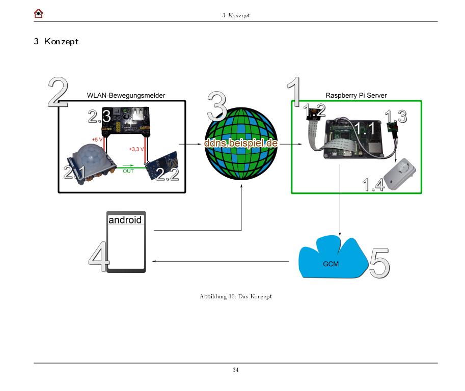
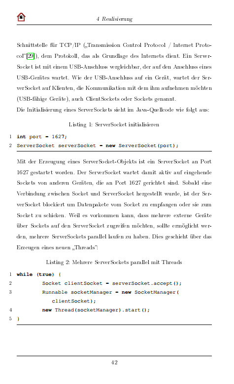
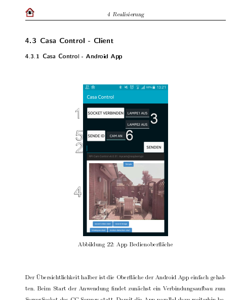
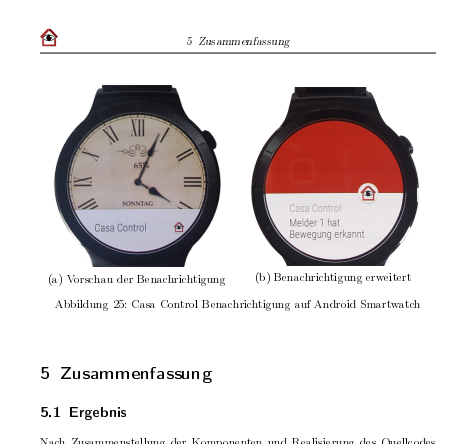

## Bachelorarbeit

Für meine Bachelorarbeit in Elektrotechnik und Informationstechnik in Hannover, 2016, habe ich mithilfe von Mikroelektronik ein Überwachungssystem entwickelt.

Die Funktionalitäten umfassen:
- Raspberry Pi als Servereinheit (Java)
- Native Android-App mit Steuerungselementen (Java)
- Bewegungserkennung mit einem ESP8266 als PIR (LUA)
- Schalten einer Steckdose per 433-MHz-Funk
- Livestream einer Raspberry-Pi-Kamera
- Push-Benachrichtigungen auf Smartphone und Smartwatch

### Warum ich meinen eigenen Weg gegangen bin
Obwohl es viele Möglichkeiten gab, bestehende Smarthome/IoT-Systeme wie FHEM und openHAB zu nutzen, habe ich mich entschieden, mein eigenes Backend zu programmieren.
Ich wollte tief in die Welt der Sockets, Push-Benachrichtigungen und Sessions eintauchen – das hat mir geholfen zu verstehen, wie die Struktur hinter jeder Anwendung aussieht.

### Warum Googles Push-Dienst
Ich habe Googles Firebase Cloud Messaging für das Senden und Empfangen von Push-Benachrichtigungen auf jedem Smartphone verwendet. Ich habe mich dagegen entschieden, meine eigene Push-Technik zu implementieren,
da Googles Messaging reibungslos funktioniert und den Smartphone-Akku nicht zu stark belastet, da es auf iPhone- und Android-Geräten ohnehin bereits läuft.

### Welcher Texteditor
Ich begann meine Arbeit mit MS Word, aber als ich anfing, mit dem Kopf gegen die Wand zu schlagen, erinnerte ich mich schnell an eine andere Möglichkeit:
LaTeX. Ich fing an, mich mit LaTeX zu beschäftigen, indem ich meine Arbeit damit schrieb, und werde nie wieder zurückgehen.
Die großen Vorteile in meinem Fall waren das Abkürzungsverzeichnis, das Abbildungsverzeichnis und das Quellenverzeichnis, Code-Listings, mathematische Formeln, Hyperlinks im PDF,
Fußnoten, Kopfzeilen und das Mischen von DIN-A4- und DIN-A3-Layouts.

---
### Konzept

---
### Listing

---
### Android-App

---
### Push-Benachrichtigung

---
### PDF herunterladen (Deutsch)
[BA_Folkerts.pdf](../assets/pdf/BA_Folkerts.pdf)
