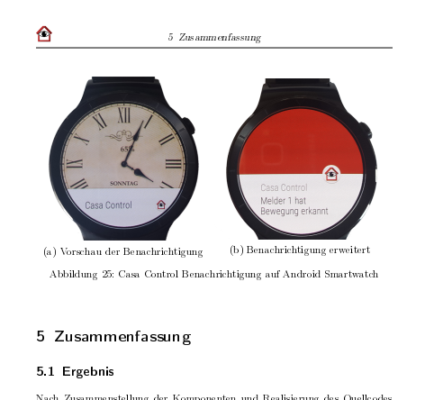

## Bachelor Thesis

For my bachelor thesis in Electrical Engineering and Information Technology in Hannover, 2016, I developed a surveillance system with the help of microelectronics.

The functionalities are 
- Raspberry Pi as a serving unit (Java)
- Native Android App with controls (Java)
- detecting movement with an ESP8266 as PIR (LUA)
- toggling a power outlet by 433 MHz radio
- Livestream of a Raspberry Pi camera
- Push notifications on phone + smartwatch 

### Why I went my own way
Although there were many possibilities to use existing smarthome/IoT systems like FHEM and openHAB, I decided on programming my own backend. 
I wanted to dive deep into the world of sockets, push notifications and sessions, that is what helped me understand how the structure behind every application looks like.

### Why Google's Push Service
I used Google's Firebase Cloud Messaging for sending and receiving push notifications on any phone. I decided against implementing my own push technique, 
because Google's messaging works flawless and it is not draining the smartphone battery too much, as it is running on iPhone and Android devices already anyway.

### Which Texteditor 
I started writing my thesis with MS Word but when I began banging my head against a wall I quickly remembered a different possibility:
LaTeX. I started getting into Latex with writing my thesis and will not return back. 
The big advantages in my case were the list of abbreviations, images and sources, code listings, math formulas, hyperlinks in pdf, 
footnotes, header and mixing DIN A4 with DIN A3 layouts.

---
### Concept

---
### Listing

---
### Android App

---
### Push Notification

---
### Download PDF (German)
[BA_Folkerts.pdf](../assets/pdf/BA_Folkerts.pdf)
