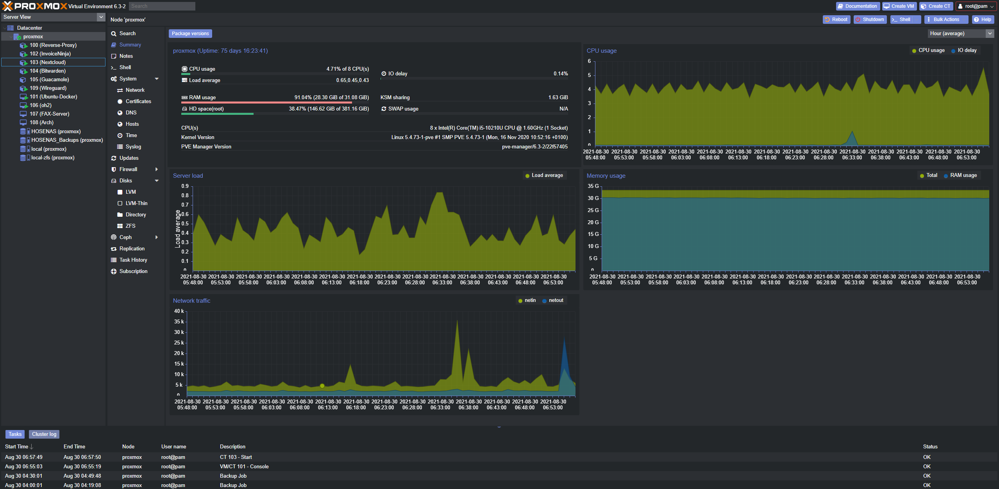
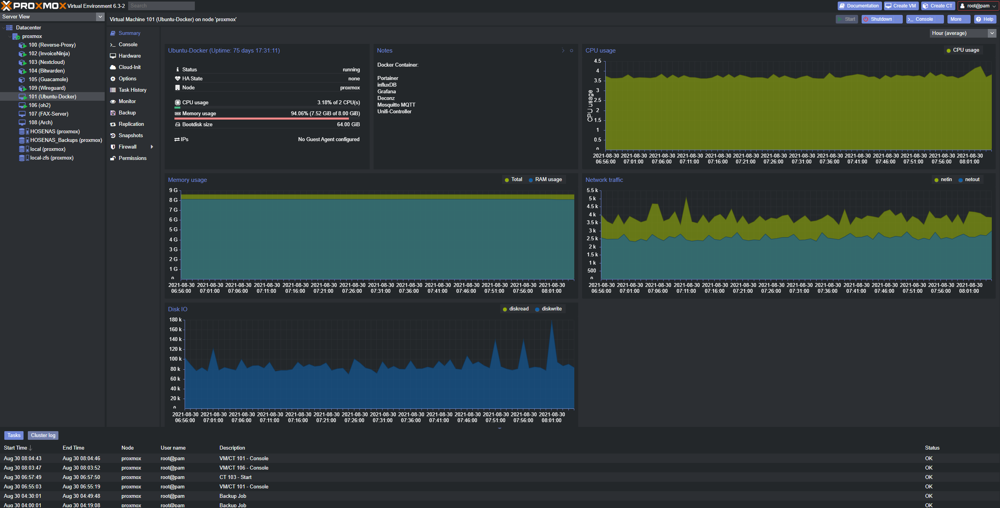
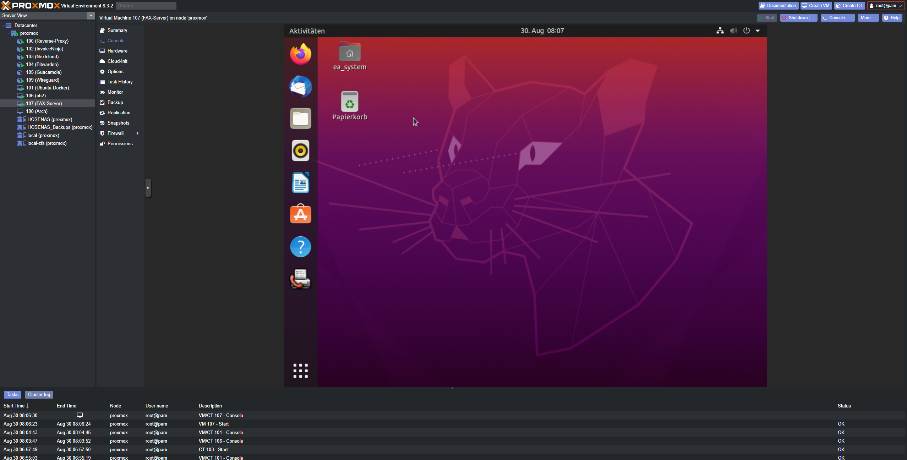
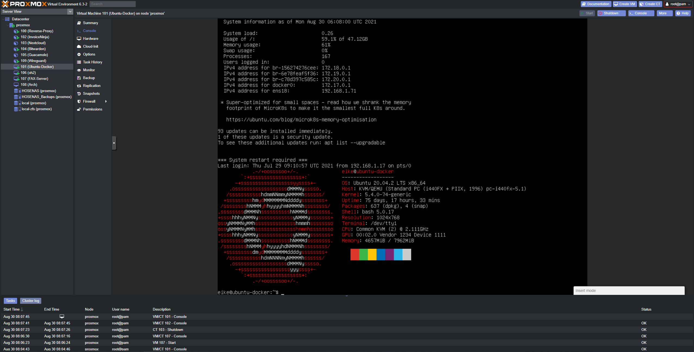

## Proxmox Server Virtualization

My personal setup of racks with servers, switches and other devices startet many years ago with only a Raspberry Pi 1. 
It served as a multimedia-center to stream movies from my PC to the TV. Soon I 'needed' a NAS to store my movies and files in the local network, 
an interface to access my network from the outside and of course software to turn light scenes when watching movies. 
The system grew and so did the power consumption and my knwoledge of how things in a 'home lab' work. 

To reduce complexity and increase the ability to easily manage all the different services, I looked for an observing, unifying system and discovered Docker. 
With Docker i was able to test and run services in containers, without affecting each other. But soon Docker came to its limits for my needs, that's when I discovered Proxmox.
Proxmox is also able to containerise Linux services but also runs Virtual Machines, so that it was possible to emulate any system I need. 
It is similar to VMWare and Hyper-V, but with the difference that it is opensource and has a free version.

Today, multiple Proxmox instances are running on efficient, powerful and reliable computer systems. 
Not only for my personal use but for friends, family and clients, my server farm became much more important over the years. 
Especially things like 
- redundant power supplies and NICs
- reliable harddrives with ZFS filesystem in a RAID
- High Availability for important services with multiple Proxmox Nodes if one dies
- EEC RAM
- network bonding and bridging as well as 
- daily incremental backups 

made my admin-life much easier.

This is a summary of a VM:

The GUI is also accessible over Proxmox' Webinterface:

Also of course its Shell:

