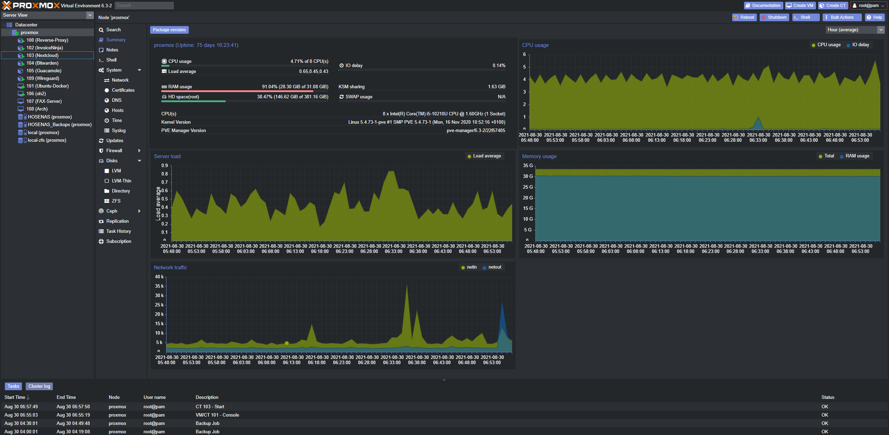
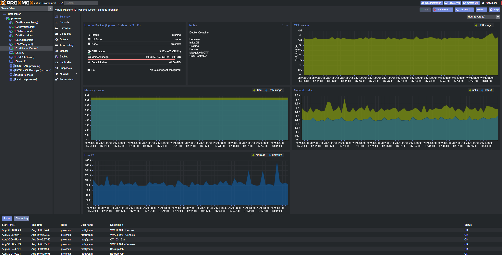
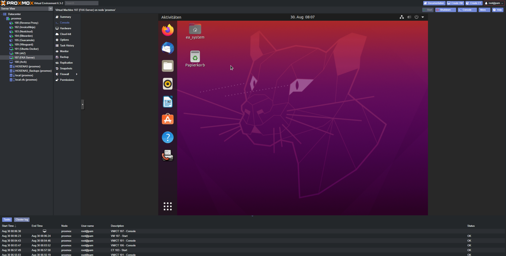
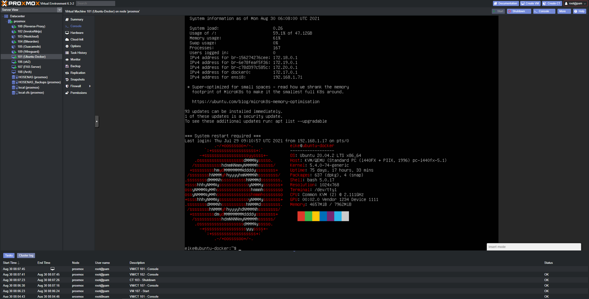

## Proxmox Server-Virtualisierung

Mein persönliches Rack-Setup mit Servern, Switches und anderen Geräten begann vor vielen Jahren mit nur einem Raspberry Pi 1.
Er diente als Multimedia-Center zum Streamen von Filmen vom PC auf den Fernseher. Bald "brauchte" ich ein NAS zum Speichern meiner Filme und Dateien im lokalen Netzwerk,
eine Schnittstelle für den Zugriff auf mein Netzwerk von außen und natürlich Software zum Schalten von Lichtszenen beim Filmschauen.
Das System wuchs und damit auch der Stromverbrauch und mein Wissen darüber, wie die Dinge in einem "Homelab" funktionieren.

Um die Komplexität zu reduzieren und die Verwaltung aller verschiedenen Dienste zu vereinfachen, suchte ich nach einem übergeordneten, vereinheitlichenden System und entdeckte Docker.
Mit Docker konnte ich Dienste in Containern testen und betreiben, ohne dass sie sich gegenseitig beeinflussen. Doch bald stieß Docker für meine Anforderungen an seine Grenzen – da entdeckte ich Proxmox.
Proxmox kann Linux-Dienste ebenfalls containerisieren, betreibt aber auch Virtuelle Maschinen, sodass es möglich ist, jedes benötigte System zu emulieren.
Es ähnelt VMWare und Hyper-V, mit dem Unterschied, dass es Open Source ist und eine kostenlose Version hat.

Heute laufen mehrere Proxmox-Instanzen auf effizienten, leistungsstarken und zuverlässigen Computersystemen.
Nicht nur für den persönlichen Gebrauch, sondern auch für Freunde, Familie und Kunden ist meine Serverfarm über die Jahre deutlich wichtiger geworden.
Insbesondere Dinge wie
- redundante Netzteile und NICs
- zuverlässige Festplatten mit ZFS-Dateisystem in einem RAID
- Hochverfügbarkeit für wichtige Dienste mit mehreren Proxmox-Nodes, falls einer ausfällt
- ECC-RAM
- Netzwerk-Bonding und -Bridging sowie
- tägliche inkrementelle Backups

haben mein Admin-Leben deutlich einfacher gemacht.

Dies ist eine Zusammenfassung einer VM:

Das GUI ist auch über Proxmox' Webinterface erreichbar:

Und natürlich auch über die Shell:

