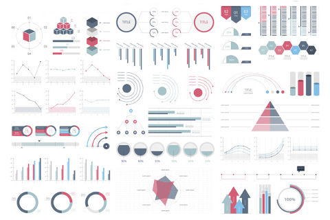

## Dies kann Ihre interne Website-Seite / Projektseite sein

**Projektbeschreibung:** Lorem ipsum dolor sit amet, consectetur adipiscing elit, sed do eiusmod tempor incididunt ut labore et dolore magna aliqua. Ut enim ad minim veniam, quis nostrud exercitation ullamco laboris nisi ut aliquip ex ea commodo consequat. Duis aute irure dolor in reprehenderit in voluptate velit esse cillum dolore eu fugiat nulla pariatur. Excepteur sint occaecat cupidatat non proident, sunt in culpa qui officia deserunt mollit anim id est laborum.

### 1. Hypothesen über die Ursachen beobachteter Phänomene vorschlagen

Sed ut perspiciatis unde omnis iste natus error sit voluptatem accusantium doloremque laudantium, totam rem aperiam, eaque ipsa quae ab illo inventore veritatis et quasi architecto beatae vitae dicta sunt explicabo.

```javascript
if (isAwesome){
  return true
}
```

### 2. Annahmen bewerten, auf denen statistische Schlussfolgerungen basieren

```javascript
if (isAwesome){
  return true
}
```

### 3. Auswahl geeigneter statistischer Werkzeuge und Techniken unterstützen




### 4. Eine Grundlage für weitere Datenerhebung durch Umfragen oder Experimente schaffen

Sed ut perspiciatis unde omnis iste natus error sit voluptatem accusantium doloremque laudantium, totam rem aperiam, eaque ipsa quae ab illo inventore veritatis et quasi architecto beatae vitae dicta sunt explicabo.

Für weitere Details siehe [GitHub Flavored Markdown](https://guides.github.com/features/mastering-markdown/).
